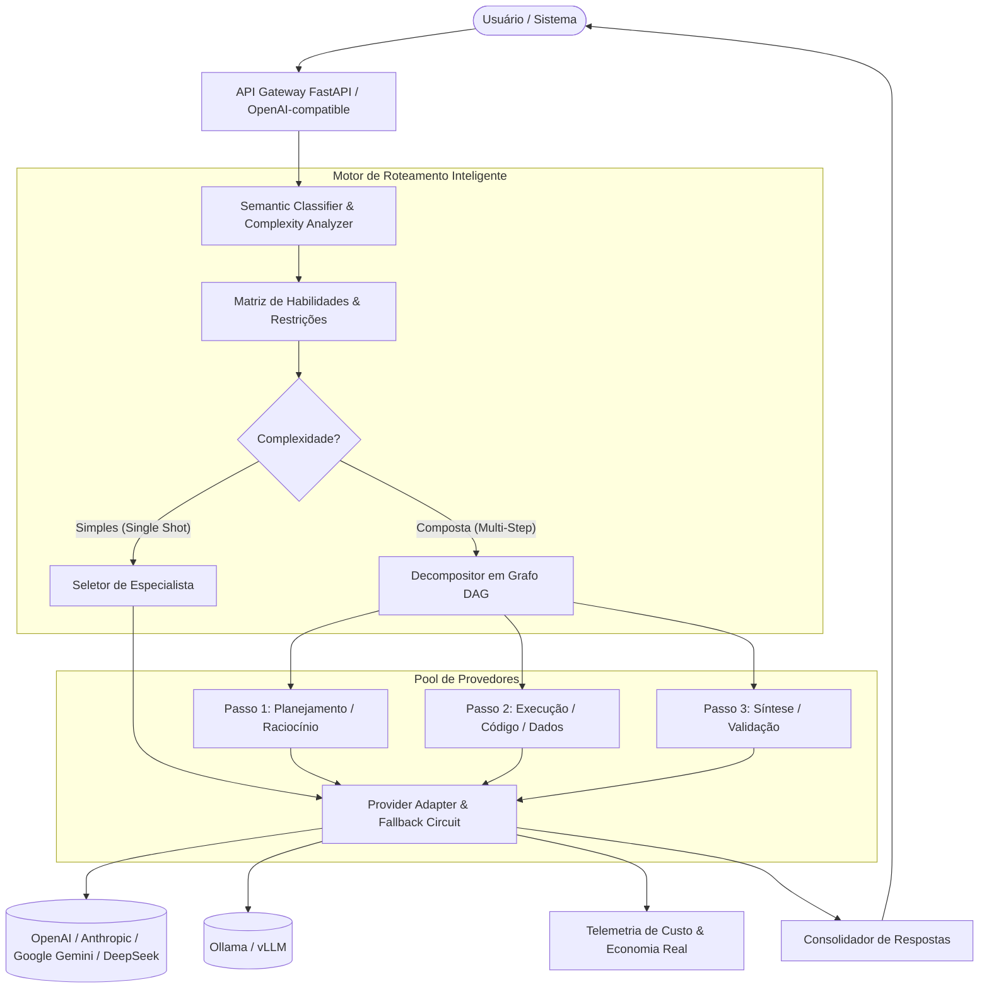

# 🧠 AI-OmniRouter: Orquestrador Inteligente Multi-Modelos de IA

> **Roteador e despachante semântico de tarefas para múltiplos provedores de LLMs com custo operacional zero de infraestrutura.**

---

## 🎯 Objetivo & Visão Geral
O **AI-OmniRouter** é uma solução *open-source*, leve e auto-hospedável projetada para receber requisições de usuários ou sistemas, analisar a intenção e complexidade semântica da tarefa e direcioná-la automaticamente para o modelo de IA ideal (Google Gemini, OpenAI, Anthropic Claude, DeepSeek ou modelos locais via Ollama/vLLM).

O objetivo central é maximizar a qualidade das respostas eliminando o desperdício financeiro de tokens, sem intermediários pagos nem taxas sobre uso de API.

---

## 📊 Benchmark de Mercado

| Solução / Framework | Foco Principal | Vantagens | Desvantagens / Gargalos |
| :--- | :--- | :--- | :--- |
| **OpenRouter / Martian** | Gateway Proxy de LLMs | Troca rápida de modelos e catálogo extenso | Cobram margem sobre tokens ou têm roteamento restrito a heurísticas superficiais |
| **RouteLLM (LMSYS)** | Roteamento Estatístico | Ótimo classificador binário (modelo fraco vs. forte) | Focado apenas em duas opções (ex: 4o vs 4o-mini), sem matriz de habilidades ou decomposição |
| **CrewAI / AutoGen** | Multi-Agentes Autônomos | Decomposição rica em papéis | Complexidade operacional alta, overhead massivo de tokens e latência cumulativa |
| **LiteLLM (Proxy)** | I/O Unificado | Interface padrão OpenAI, load balancing e fallbacks | Não classifica a semântica do prompt nativamente (roteamento manual por regras) |
| **AI-OmniRouter (Este Projeto)** | **Router Semântico + Dispatcher DAG** | **Custo Zero de Infra**, classificação semântica multidimensional, failover resiliente e decomposição em etapas | Requer configuração inicial de chaves locais de API |

---

## 🏗️ Arquitetura da Solução

---

## 💡 Princípios de Design & Custo Zero

1. **Custo Operacional Zero de Infraestrutura**:
   - Roda 100% local ou em servidor próprio sem dependência de SaaS pagos.
   - O único custo incorrido são as chamadas diretas às chaves das APIs configuradas ou **R$ 0,00** usando modelos locais (Ollama).
2. **Classificação Sem Custo**:
   - A triagem de *"quem responde"* não gasta tokens caros. É feita via heurísticas léxico-semânticas determinísticas locais ou via o tier gratuito de modelos ultra-rápidos (ex: Gemini Flash Free Tier / Groq Free).
3. **Resiliência e Failover Automático**:
   - Se o modelo selecionado sofrer *rate limit* (HTTP 429) ou indisponibilidade, o roteador aciona automaticamente o modelo substituto equivalente.
4. **Compatibilidade Universal**:
   - Padrão compatível com a API da OpenAI (`/v1/chat/completions`), permitindo conectar facilmente qualquer frontend ou agente existente.

---

## 🗺️ Matriz de Habilidades dos Modelos

| Perfil da Tarefa | Modelos Recomendados (Tier Alta Performance) | Alternativas Econômicas / Locais |
| :--- | :--- | :--- |
| **Código e Engenharia** | Claude 3.5 Sonnet, DeepSeek-V3 | Qwen 2.5 Coder (Ollama), GPT-4o-mini |
| **Raciocínio Profundo / Lógica** | OpenAI o3-mini, DeepSeek-R1 | Claude 3.7 Sonnet (Thinking), QwQ |
| **Contexto Ultra-Longo (>500k tokens)** | Google Gemini 1.5 Pro | Google Gemini 1.5 Flash |
| **Factual Rápido / Consultas Simples** | Google Gemini 1.5 Flash, Claude 3.5 Haiku | Llama 3.2 / Mistral (Ollama) |
| **Visão Computacional & Multimodal** | GPT-4o, Gemini 1.5 Pro | Pixtral / Llama 3.2-Vision |

---

## 🚀 Roteiro de Implementação (Roadmap)

### Fase 1: Fundação & Catálogo de Modelos (MVP Core)
- [x] Estruturação da arquitetura e benchmark de mercado.
- [ ] Criação do repositório e ambiente de desenvolvimento.
- [ ] Catálogo configurável de modelos (`registry.py`) com atributos de custo, latência e especialidade.
- [ ] Adaptadores base para Google Gemini, OpenAI e Anthropic.

### Fase 2: Motor de Classificação & Roteamento
- [ ] Implementação do classificador semântico local leve.
- [ ] Seletor de modelo por estratégias configuráveis (`balanced`, `cost_saving`, `quality_first`).
- [ ] Mecanismo de *circuit breaker* e fallback automático.

### Fase 3: Decompositor de Tarefas (Dispatcher DAG)
- [ ] Pipeline para decomposição de tarefas complexas em múltiplas etapas encadeadas.
- [ ] Gestão de contexto entre etapas sem explosão de tokens.

### Fase 4: Interface OpenAI & Auditoria Financeira
- [ ] Servidor FastAPI compatível com `/v1/chat/completions`.
- [ ] Log de auditoria exibindo o ROI e economia de custos por requisição.

---

## 🛠️ Tecnologias Utilizadas
- **Linguagem**: Python 3.12+ (gerenciado via `uv`)
- **API & Servidor**: FastAPI + Uvicorn + Pydantic v2
- **Roteamento & Embeddings**: Classificação local determinística + FastEmbed / ONNX
- **Integração de Modelos**: SDKs assíncronos (`google-genai`, `openai`, `anthropic`, `httpx`)
